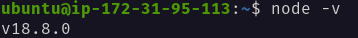
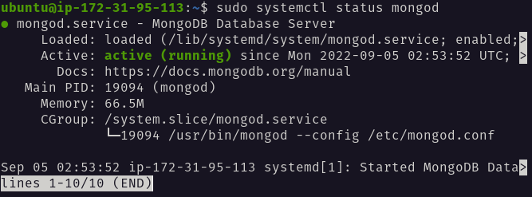
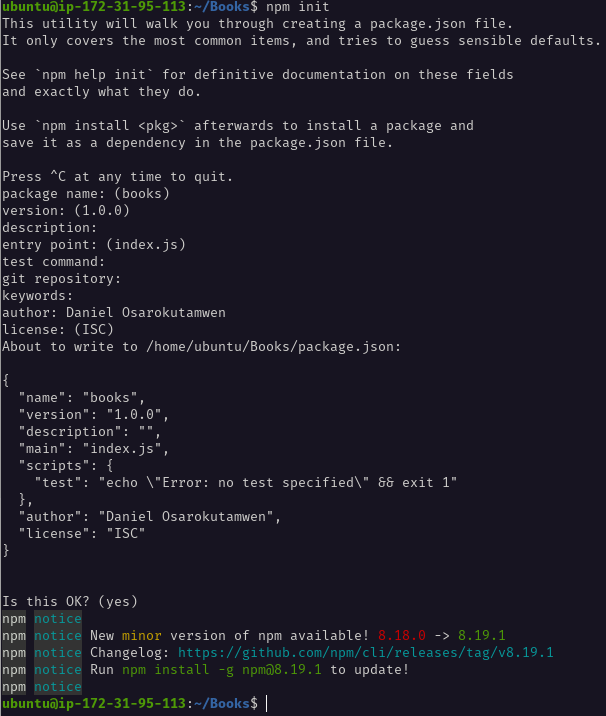
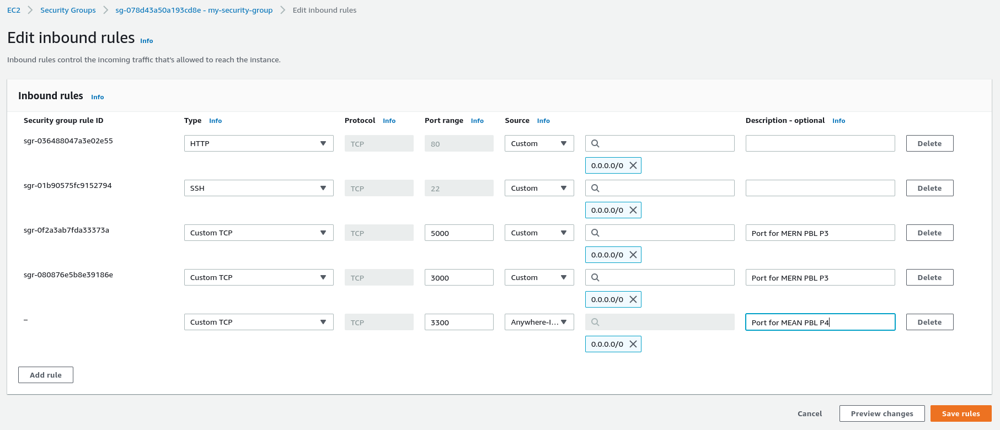
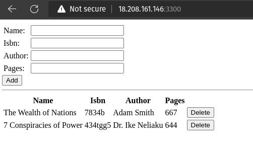

# Project 4 - MEAN Stack Implementation
---


## Backend Configuration: NodeJS & MongoDB

### Install Nodejs
- Update Ubuntu:
    ```
    sudo apt update
    ```
- Upgrade Ubuntu:
    ```
    sudo apt upgrade
    ```
- Add location of Node.js in NodeSource's Ubuntu Repository:
    ```
    curl -fsSL https://deb.nodesource.com/setup_current.x | sudo -E bash -
- Run installation of Node.js and NPM:
    ```
    sudo apt-get install -y nodejs
    ```
- Verify installation and version of Nodejs:
    ```
    node -v
    ```
    


### Install MongoDB
- Install required packages:
    ```
    sudo apt-get install -y gnupg
    ```
- Import public key:
    ```
    wget -qO - https://www.mongodb.org/static/pgp/server-6.0.asc | sudo apt-key add -
    ```
- Add location of MongoDB in repositories list:
    ```
    echo "deb [ arch=amd64,arm64 ] https://repo.mongodb.org/apt/ubuntu focal/mongodb-org/6.0 multiverse" | sudo tee /etc/apt/sources.list.d/mongodb-org-6.0.list
    ```
- Update repositories:
    ```
    sudo apt-get update
    ```
- Install mongoDB:
    ```
    sudo apt-get install -y mongodb-org
    ```
- Start MongoDB Service:
    ```
    sudo systemctl start mongod
    ```
- Enable service to start automatically even after reboot:
    ```
    sudo systemctl enable mongod
    ```
- Check status of MongoDB service:
    ```
    sudo systemctl status mongod
    ```
    


### App Configurations
- Install `body-parser`:
    ```
    sudo npm install body-parser
    ```
- Create folder named `Books` and navigate into it:
    ```
    mkdir Books && cd Books
    ```
- initialize an npm project within the `Books` directory:
    ```
    npm init
    ```
    
- Create and edit a file namd `server.js`:
    ```
    vi server.js
    ```
- Insert the following code:
    ```
    var express = require('express');
    var bodyParser = require('body-parser');
    var app = express();

    app.use(express.static(__dirname + '/public'));
    app.use(bodyParser.json());

    require('./apps/routes')(app);

    app.set('port', 3300);

    app.listen(app.get('port'), function() {
        console.log('server up: http://localhost:' + app.get('port'));
    });
    ```


### Install Express, Mongoose, & Setup Routes to Server
- Install Express and Mongoose with npm:
    ```
    sudo npm install express mongoose
    ```
- Create folder within `Books` named `apps` and navigate into it:
    ```
    mkdir apps && cd apps
    ```
- Create and edit a file named `routes.js`:
    ```
    vi routes.js
    ```
- Insert the following code:
    ```
    var Book = require('./models/book');

    module.exports = function(app) {
        app.get('/book', function(req, res){
            Book.find({}, function(err, result){
                if ( err ) throw err;
                res.json(result);
            });
        });
        
        app.post('/book', function(req, res) {
            var book = new Book( {
                name:req.body.name,
                isbn:req.body.isbn,
                author:req.body.author,
                pages:req.body.pages
            });
            book.save(function(err, result) {
                if ( err ) throw err;
                res.json( {
                    message:"Successfully added book",
                    book:result
                });
            });
        });

        app.delete("/book/:isbn", function(req, res) {
            Book.findoneAndRemove(req.query, function(err, result) {
                if ( err ) throw err;
                res.json( {
                    message:"Successfully deleted the book",
                    book:result
                });
            });
        });

        var path = require('path');
        app.get('*', function(req, res) {
            res.sendfile(path.join(__dirname + '/public', 'index.html'));
        });
    };
    ```
- Create folder within `apps` named `models` and navigate into it:
    ```
    mkdir models && cd models
    ```
- Create and edit a file named `book.js`:
    ```
    vi book.js
    ```
- Insert the following code:
    ```
    var mongoose = require('mongoose');
    var dbHost = 'mongodb://localhost:27017/test';

    mongoose.connect(dbHost);
    mongoose.connection;
    mongoose.set('debug', true);

    var bookSchema = mongoose.Schema( {
        name: String,
        isbn:{type: String, index: true},
        author: String,
        pages: Number
    });

    var Book = mongoose.model('Book', bookSchema);

    module.exports = mongoose.model('Book', bookSchema);
    ```


---

## Frontend Setup: AngularJS

### Access Routes with AngularJS
- Navigate back to the Application's root directory `Books`:
    ```
    cd ../..
    ```
- Create folder within `Books` named `public` and navigate into it:
    ```
    mkdir public && cd public
    ```
- Create and edit a file named `script.js`:
    ```
    vi script.js
    ```
- Insert the following code:
    ```
    var app = angular.module('myApp', []);

    app.controller('myCtrl', function($scope, $http) {
        $http( {
            method: 'GET',
            url: '/book'
        }).then(function successCallback(response) {
            $scope.books = response.data;
        }, function errorCallback(response) {
            console.log('Error: ' + response);
        });

        $scope.del_book = function(book) {
            $http( {
                method: 'DELETE',
                url: '/book/:isbn',
                params: {'isbn': book.isbn}
            }).then(function successCallback(response) {
                console.log(response);
            }, function errorCallback(response) {
                console.log('Error: ' + response);
            });
        };

        $scope.add_book = function() {
            var body = '{ "name": "' + $scope.Name + 
            '", "isbn": "' + $scope.Isbn + 
            '", "author": "' + $scope.Author + 
            '", "pages": "' + $scope.Pages + '" }';
            $http({
                method: 'POST',
                url: '/book',
                data: body
            }).then(function successCallback(response) {
                console.log(response);
            }, function errorCallback(response) {
                console.log('Error: ' + response);
            });
        };
    });
    ```
- Create and edit a file within `public` directory named `index.html`:
    ```
    vi index.html
    ```
- Insert the following code:
    ```
    <!doctype html>
    <html ng-app="myApp" ng-controller="myCtrl">
    <head>
        <script src="https://ajax.googleapis.com/ajax/libs/angularjs/1.6.4/angular.min.js"></script>
        <script src="script.js"></script>
    </head>
    <body>
        <div>
            <table>
                <tr>
                    <td>Name:</td>
                    <td><input type="text" ng-model="Name"></td>
                </tr>
                <tr>
                    <td>Isbn:</td>
                    <td><input type="text" ng-model="Isbn"></td>
                </tr>
                <tr>
                    <td>Author:</td>
                    <td><input type="text" ng-model="Author"></td>
                </tr>
                <tr>
                    <td>Pages:</td>
                    <td><input type="number" ng-model="Pages"></td>
                </tr>
            </table>
        <button ng-click="add_book()">Add</button>
        </div>
        <hr>
        <div>
            <table>
                <tr>
                    <th>Name</th>
                    <th>Isbn</th>
                    <th>Author</th>
                    <th>Pages</th>
                </tr>
                <tr ng-repeat="book in books">
                    <td>{{book.name}}</td>
                    <td>{{book.isbn}}</td>
                    <td>{{book.author}}</td>
                    <td>{{book.pages}}</td>

                    <td><input type="button" value="Delete" data-ng-click="del_book(book)"></td>
                </tr>
            </table>
        </div>
    </body>
    </html>
    ```
- Navigate back to the Application's root directory `Books`:
    ```
    cd ../..
    ```
- Start the NodeJS webserver:
    ```
    node server.js
    ```
- App now running on port 3300. Hence, open port 3300 in EC2 instance:

